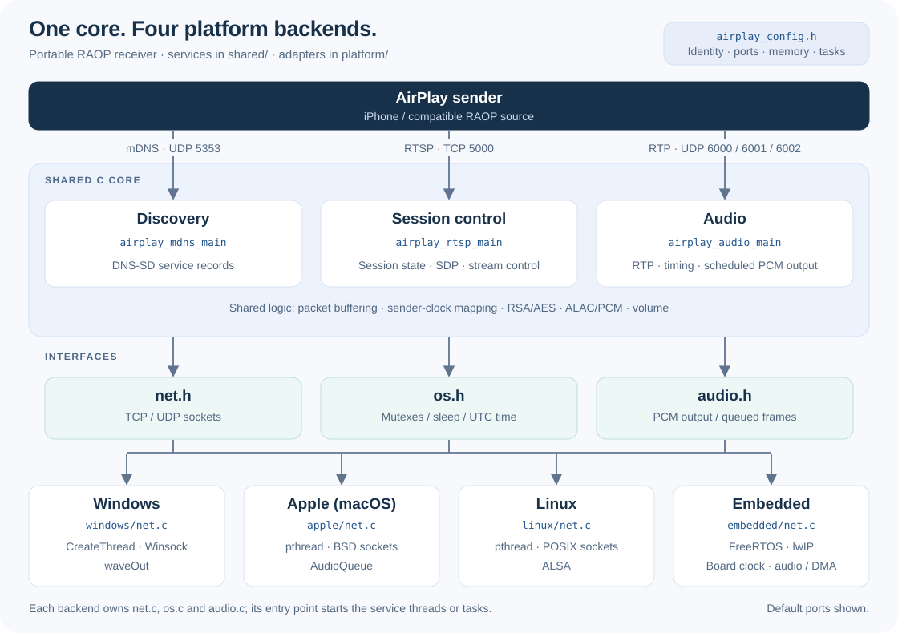
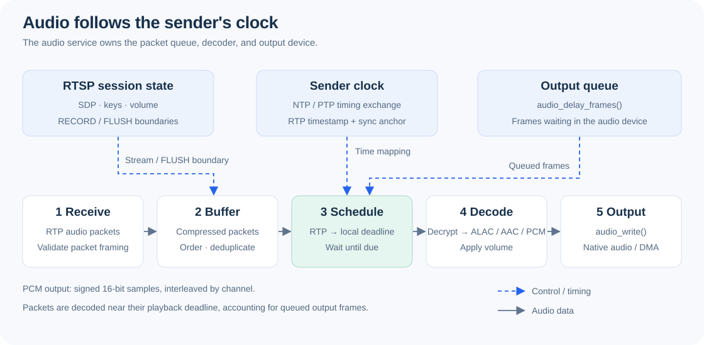

# AirPlay Speaker

A portable C AirPlay audio receiver for computers and embedded systems. It supports traditional RAOP over UDP and AirPlay 2 realtime ALAC over UDP or buffered AAC over TCP. Audio is decrypted, decoded, and scheduled against the sender's NTP or PTP clock. One audio stream is active at a time.

## System Overview



The shared core owns discovery, session control, decoding, and playback scheduling. Each platform provides networking, mutexes, time, and audio output, and starts three native threads or FreeRTOS tasks:

| Service | Entry point | Responsibility |
| --- | --- | --- |
| Discovery | `airplay_mdns_main` | Advertise `_raop._tcp` and `_airplay._tcp` through mDNS |
| Session control | `airplay_rtsp_main` | Handle RTSP requests and publish synchronized session state |
| Audio | `airplay_audio_main` | Receive UDP/TCP audio, synchronize clocks, buffer packets, decode, and output PCM |

```text
airplay_config.h   Device identity, service ports, audio defaults, memory limits, task settings
shared/            Common C services, protocols, decoding, and scheduling
platform/net.h     TCP/UDP interface
platform/os.h      Mutex, sleep, and UTC clock interface
platform/audio.h   PCM output interface
platform/windows/  Winsock, Windows threads, and waveOut output
platform/apple/    BSD sockets, macOS pthreads, and AudioQueue output
platform/linux/    Linux sockets, pthreads, and ALSA output
platform/embedded/ lwIP, FreeRTOS tasks, and board audio/clock interfaces
tests/             Protocol, network, lifecycle, decoding, and timing tests
```



The platform initializes networking and the server, starts the three services, waits for them to stop, and releases resources. The RTSP service publishes session snapshots under a mutex; the audio service owns the decoder and audio device. Platform implementations are selected at build time.

Each platform directory contains its own `net.c`, `os.c`, and `audio.c`. CMake selects one set of implementations; shared services depend only on the platform headers. The embedded network adapter calls the `lwip_*` APIs directly.

The shared core is independent of the processor and operating system. The included embedded backend uses FreeRTOS and lwIP with board-supplied audio and clock functions. Other embedded environments can reuse the core by implementing the `net.h`, `os.h`, and `audio.h` contracts and starting the service tasks in their platform entry point.

Edit [airplay_config.h](airplay_config.h) to configure the speaker name, ports, and memory limits, then rebuild. The default name is `TestSpeaker`. Runtime IP, MAC, and optional name are passed through `airplay_config_t`.

## Build

Use a C11 compiler and CMake 3.20 or newer. Run the commands below from this directory. Desktop builds fetch mbedTLS 2.28.8 automatically; use `-DAIRPLAY_MBEDTLS_SOURCE_DIR=/path/to/mbedtls` to build from an existing source tree.

### Windows

Install MinGW-w64 GCC, CMake, and Ninja, and make them available on `PATH`.

```powershell
cmake -S . -B ../build -G Ninja -DCMAKE_BUILD_TYPE=Debug
cmake --build ../build -j 8
ctest --test-dir ../build --output-on-failure
..\build\airplay_player.exe
```

With no arguments, the player selects an active IPv4 adapter. To choose an interface or override the name:

```powershell
..\build\airplay_player.exe 192.168.1.50 020000000050 MySpeaker
```

### Linux

Install ALSA development headers and libraries (`libasound2-dev` on Debian/Ubuntu).

```sh
cmake -S . -B ../build -DAIRPLAY_PLATFORM=linux -DCMAKE_BUILD_TYPE=Debug
cmake --build ../build -j 8
ctest --test-dir ../build --output-on-failure
../build/airplay_player 192.168.1.50 020000000050 MySpeaker
```

### Apple (macOS)

Install the Xcode Command Line Tools and CMake. The backend uses the system AudioToolbox framework.

```sh
cmake -S . -B ../build -DAIRPLAY_PLATFORM=apple -DCMAKE_BUILD_TYPE=Debug
cmake --build ../build -j 8
ctest --test-dir ../build --output-on-failure
../build/airplay_player 192.168.1.50 020000000050 MySpeaker
```

Replace the example IP and MAC with the selected interface's values. The MAC is a 12-digit hexadecimal string without separators; the name is optional. Allow mDNS multicast on UDP 5353 and the configured service ports (TCP 5000 and 6000, UDP 6000-6002, and PTP UDP 319-320 by default). Press Ctrl+C to stop.

### Embedded (FreeRTOS and lwIP)

Build this project as part of the board firmware using its cross-compilation toolchain. Provide FreeRTOS, lwIP, a board-configured `mbedcrypto` target, and the SDK include directories before adding this project:

```cmake
set(AIRPLAY_PLATFORM embedded CACHE STRING "" FORCE)
set(AIRPLAY_PLATFORM_INCLUDE_DIRS
    "${FREERTOS_INCLUDE_DIRS};${LWIP_INCLUDE_DIRS};${BOARD_INCLUDE_DIRS}"
    CACHE STRING "" FORCE)
add_subdirectory(path/to/airplay)
target_link_libraries(firmware PRIVATE airplay_embedded)
```

Here, `firmware` is the board's executable target and the include variables refer to its SDK directories. As an alternative to supplying `mbedcrypto`, set `AIRPLAY_MBEDTLS_SOURCE_DIR` to a source tree configured for the board. Build the firmware with its normal CMake toolchain and build commands.

Implement the four audio functions declared in [board_audio.h](platform/embedded/board_audio.h), plus `airplay_board_time_us` from [runtime.h](platform/embedded/runtime.h). The clock must return Unix UTC microseconds. Audio writes must copy or consume interleaved 16-bit PCM before returning; queued DMA frames must be included in the output-delay estimate.

FreeRTOS must enable dynamic allocation, mutexes, and event groups. Configure lwIP with `NO_SYS=0`, sockets/netconn, socket select, IPv4/TCP/UDP, IGMP, multicast transmit options, and address reuse. The adapter supports `LWIP_COMPAT_SOCKETS=0`. Provide `sys_now()`. Enable the RSA, AES, SHA-1, Base64, entropy, and random-number facilities used by mbedTLS.

After the scheduler, network interface, and clock are ready, call `airplay_platform_start(&config)` from one owner task. That task also calls `airplay_platform_stop()` and waits for cleanup. Use the board's IP and MAC, with `.device_name = AIRPLAY_DEVICE_NAME` for the configured name.

Check memory and task-stack settings in `airplay_config.h` against the board's resources. The default compressed-packet payload storage alone uses about 736 KiB; task stacks, decoder state, networking, and DMA require additional memory. macOS and embedded builds still require validation with their target SDKs and hardware.
